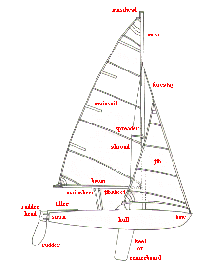
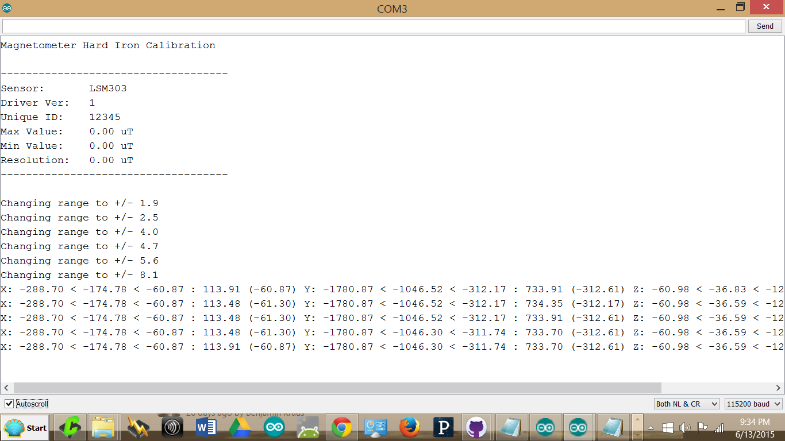
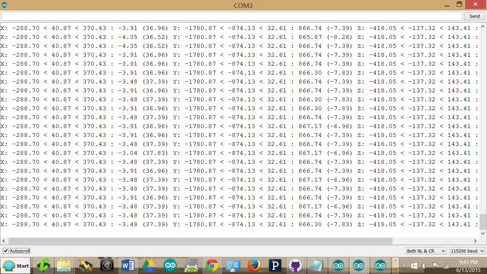

RoboSail Hardware Tests
[](https://travis-ci.org/RoboSail/RoboSail_Hardware_Tests)
=======================


This repository includes the configuration file for all RoboSail setup -- `RoboSail_Hardware.h` -- and includes example sketches for testing and calibrating all of them.

> Note: this repository was formerly the `hardware` folder


## Installation

This code should be downloaded -- either by `git clone` or by downloading the Zip file -- to your Arduino IDE's `libraries` directory.

> If downloading a zip file, note that the downloaded file will be `RoboSail_Hardware_Tests-master.zip`.  You should rename it (and/or the extracted folder) to simply `RoboSail_Hardware_Tests`.


## Theory of Operation

The 2-channel RadioControl (RC) Transmitter/Receiver pair come with the sailboat. The signals are originally used to directly control the servos. When the RoboSail control system is installed, the signals from the Receiver are routed through the Arduino, then processed before getting to the servo motors.

To make automatic control, the outputs to the servo motors are based on the sensor inputs, not the user inputs.  When automatic control is implemented, the signals from the RC transmitter can be used to send switch signals or other cues to the boat to switch modes of operation.

The Arduino Computer goes between the RC Transmitter/Receiver and the Servo Motors. The signal that is read in from the receiver is mapped to the range of motion (in degrees) that we define for the boat.  The Rudder ranges -80 to +80 degrees with 0 at the center, while the Sailservo is a multiturn winch that we only use in 1 direction (so the line does not rewind in the other direction after unwinding). We define 0 degrees as the line (and the sail) is fully wound in and at 90 degrees the line (and the sail) is fully out.

To create the proper command for the servo, we need to create servo positions that correspond to the degree positions that we want.  Servos usually run from 0 to 180 degrees, however there may be physical limits that prevent full movement.  In this case, the rudder is a bit limited at the ends of its travel by the connecting rods.  The rudder servo has its center point at roughly 90 degrees.  The sail servo is at 90 when fully in, 90 when fully out, and 90 to 180 is not used as it would rewind the line.

Once the correct servo positions are calculated, they are output to the servos by on-board PWM facilities.


Initial Hardware Setup
======================

Before you can use any of the code examples, the wiring must be completed and recorded in the settings file.

> This section only applies to people who want to follow along with their own hardware. If you're a RoboSail student you can skip this: it's already been done for you.

* Connections on Grove Seeeduino Mega shield which has servo connectors
* Cut V trace on board for separate power source to servo bus. Grounds stay connected
* Connect receiver to servo slots 11 (rudder STR), 12, (sail THR)
* Connect servos to servo slots 8 (rudder) and 9 (sailWinch).


## Recording the Pinout

This is how the pins are named in RoboSail code:

Pin | Assignment           | Constant
----|----------------------|-----------------------
2   | RC receiver rudder   | `ROBOSAIL_PIN_RUDDER_RC`
3   | RC receiver sail     | `ROBOSAIL_PIN_SAIL_RC`
8   | Servo rudder         | `ROBOSAIL_PIN_RUDDER_SERVO`
9   | Servo sail           | `ROBOSAIL_PIN_SAIL_SERVO`


Calibration and Tuning
======================

These boat constants will differ slightly for each set of hardware used. Each team should record and save the constants that are unique to their boat.  These are all recorded in `RoboSail_Hardware.h`, a file that should be included by any & all RoboSail sketches.

Variable (constant)           | Measured Value
------------------------------|----------------
`ROBOSAIL_RUDDER_RC_LOW`      |
`ROBOSAIL_RUDDER_RC_HIGH`     |
`ROBOSAIL_SAIL_RC_LOW`        |
`ROBOSAIL_SAIL_RC_HIGH`       |
`ROBOSAIL_WIND_SENSOR_LOW`    |
`ROBOSAIL_WIND_SENSOR_HIGH`   |
`ROBOSAIL_RUDDER_SERVO_LOW`   |
`ROBOSAIL_RUDDER_SERVO_HIGH`  |
`ROBOSAIL_SAIL_SERVO_LOW`     |
`ROBOSAIL_SAIL_SERVO_HIGH`    |


Example values:

Variable (constant)           | Measured Value
------------------------------|----------------
`ROBOSAIL_RUDDER_RC_LOW`      | 1096
`ROBOSAIL_RUDDER_RC_HIGH`     | 1924
`ROBOSAIL_SAIL_RC_LOW`        | 1092
`ROBOSAIL_SAIL_RC_HIGH`       | 1892
`ROBOSAIL_WIND_SENSOR_LOW`    | 0
`ROBOSAIL_WIND_SENSOR_HIGH`   | 1024
`ROBOSAIL_RUDDER_SERVO_LOW`   | 0
`ROBOSAIL_RUDDER_SERVO_HIGH`  | 180
`ROBOSAIL_SAIL_SERVO_LOW`     | 55
`ROBOSAIL_SAIL_SERVO_HIGH`    | 125


To calculate the values and tune the boat follow these steps:


## Characterize the RC System

1. Run [RCReader.ino](examples/RCReader/RCReader.ino) and open a terminal to examine the measured values.
2. Center all trim sliders on the RC transmitter.
3. Move the left stick (the "throttle") all the way down. Record the sail value as `ROBOSAIL_SAIL_RC_LOW`.
4. Move the left stick all the way up. Record the sail value as `ROBOSAIL_SAIL_RC_HIGH`.
5. Move the right stick (the "steering") all the way right. Record the rudder value as `ROBOSAIL_RUDDER_RC_LOW`.
6. Move the right stick all the way left. Record the rudder value as `ROBOSAIL_RUDDER_RC_HIGH`.

Note that the ranges for each axis (minimum and maximum values measured) are listed in the `RCReader.ino` output, so simply moving the sticks to their extreme ranges will characterize them.

Note that The rudder measurement additionally shows the average ("ctr") value of the range, so that you can adjust the trim accordingly -- you want the resting position of the stick to correspond to the center rudder position.


## Calibrate the Servos

### Calibrate the Sail Servo

Make sure you have a hex key tool.

1. Loosen the mainsheet and jibsheet from their booms so that they can slide freely.
2. Run [SailServoTest.ino](examples/SailServoTest/SailServoTest.ino) and open the Serial Terminal to interact with it.
3. Set a servo position value of 70 -- it should be well within the available range of motion for the sail
4. Gradually increase the position until the mainsail is at 90 degrees from the boat.
5. Record this position as `ROBOSAIL_SAIL_SERVO_HIGH`.
6. Record the sail angle (if less than 90 degrees) as `ROBOSAIL_SAIL_ANGLE_HIGH`.  In other words, it should be 90 unless there is a physical inability for it to reach 90 degrees.
7. Gradually decrese the servo position until the mainsheet and/or jibsheet are hauled all the way in.
8. Record this position as `ROBOSAIL_SAIL_SERVO_LOW`
9. Record the sail angle (if greater than 0 degrees) as `ROBOSAIL_SAIL_ANGLE_LOW`


### Calibrate the Rudder Servo

1. Run [RudderServoTest.ino](examples/RudderServoTest/RudderServoTest.ino) and open the Serial Terminal to interact with it.
2. Set a servo position value of 90 -- it should correspond roughly to the center point of the rudder.
3. Gradually increase the position until the servo is at the limit of its ablity to move the rudder (based on its linkages).
4. Record this position as `ROBOSAIL_RUDDER_SERVO_HIGH`.
5. Record the rudder angle as `ROBOSAIL_RUDDER_ANGLE_HIGH` (this number should be negative).
6. Gradually decrease the position until the servo is at the limit of its ability to move the rudder in the opposite direction.
7. Record this position as `ROBOSAIL_RUDDER_SERVO_LOW`.
8. Record the rudder angle as `ROBOSAIL_RUDDER_ANGLE_LOW` (this number should be positive).


### Test the Servo Calibration

1. Run [RCPassthrough.ino](examples/RCPassthrough/RCPassthrough.ino) and open a terminal to examine the measured values.
2. Verify that moving the right stick right will place the rudder at its maximum rightward position (turning to starboard) but not put strain on the servo.
3. Verify that moving the right stick left will place the rudder at its maximum leftward position (turning to port) but not put strain on the servo.
4. Verify that the rudder returns to a center position when the right stick returns to its center position.
5. Verify that moving the left stick all they way up will allow the sails to move out to 90 degrees from the boat.
6. Verify that moving the left stick all the way down will haul the sails in to the angle you recorded as `ROBOSAIL_SAIL_ANGLE_LOW`.


## Characterize the Wind Sensor

Our wind sensor is attached to the top of the mast and will return a value from -180 to 180.

It uses a 10-bit magnetic digital encoder that creates a digital pulse, the length of which corresponds to its rotary position. The code reads this in using the pulseIn function then maps it to the desired range of -180 to 180 degrees. Both the pulse value and the mapped values are displayed to the serial Monitor.

Nominal values for the position are 0 to 1023. Use the code to determine if the actual range is smaller and there are "dead spots".  You can then change the map function accordingly.

1. Run [WindSensor.ino](examples/WindSensor/WindSensor.ino) and open a terminal to examine the measured values.
2. Rotate the wind vane until the rollover point is found (eg, from 0 to 1024).
3. Loosen the wind vane sensor, and rotate it until the rollover point is set directly forward.
4. Fix the wind vane sensor in place.
5. Measure the minimum value of the wind sensor. Record this value as `ROBOSAIL_WIND_SENSOR_LOW`.
6. Measure the maximum value of the wind sensor. Record this value as `ROBOSAIL_WIND_SENSOR_HIGH`.


## Compass: Calibrate and Read
For Compass Heading there is an electronic magnetometer board that also includes a 3-axis accelerometer - Adafruit LSM-303DLHC. A magnetometer can be calibrated and will work fine on flat surfaces away from magnetic fields, however, a boat heels significantly. Therefore a compass needs to be tilt-compensated. Information from the board's 3-axis magnetometer and 3-axis accelerometer are combined in some tricky software to give a compass reading within +-5°.

Hardiron calibration must be performed. The process is simple:

1. Set the compass declination in the variable `ROBOSAIL_DECLINATION` using the source data at http://www.ngdc.noaa.gov/geomag-web/#igrfwmm ; a reasonable value should be something like `-14.6067` in the Boston area.
2. Run [compassBasic.ino](examples/compassBasic/compassBasic.ino)and verify hardware and connections prints raw accelerometer and magnetometer readings to the screen
3. Run [compassCalibration.ino](examples/compassCalibration/compassCalibration.ino) which will help to determine hard iron calibration values
4. Rotate the body through all possible orientations
5. Record the averaged minimum and maximum for each axis of the magnetometer as `ROBOSAIL_HARDIRON_X`, `ROBOSAIL_HARDIRON_Y`, and `ROBOSAIL_HARDIRON_Z`
6. Run [compassBasicwithCalibration.ino](examples/compassBasicwithCalibration/compassBasicwithCalibration.ino) and verify the corrected values
7. Run [compassTest.ino](examples/compassTest/compassTest.ino) and verify the Tilt-compensated compass with hard-iron correction.


## GPS: Read

The GPS provides location information in degrees latitude and longitude and updates this information every second.  To do this it must have a "clear view of the sky" and so it can get a fix from 3 satellites, (though it can work with only 1).  An additional antenna is used to  improve reception.  It must be mounted horizontal, but can be in the hull of the boat.

Latitude and Longitude are read in degrees and minutes and cover the entire world.  Software has been provided (in the UsefulCalcs library) that converts the latitude and longitude degrees into a simple x, y grid using a method called UTM (Universal Transverse Mercator).  The accuracy is still only +-2 meters, but the numbers are much easier to use.

Run [GPSTest.ino](examples/GPSTest/GPSTest.ino) to determine whether the sensor is properly connected and returning data.


Technical Notes
===============


## Parts of a sailboat




## VARIABLES defined as Absolute and Relative

What is meant by Relative and Absolute

Relative is relative to the boat. Wind at the nose is 0 degrees, and it goes from 0-180 on the starboard side and 0 to -180 on the port side. A relative boat direction of 90 means turning the boat 90 degrees to starboard

Absolute is relative to the world. East is 0, and it increases in the counter clockwise direction. If the boat is at (0, 0) and the next waypoint is (-20, 20), the next waypoint is at an absolute heading of 135 degrees, regardless of which direction the boat is pointing at the moment


## Roll, Pitch, and Yaw

The roll, pitch, yaw, and headings all use the standard (Aircraft)
orientations:
https://en.wikipedia.org/wiki/Aircraft_principal_axes

* A positive roll angle lifts the left wing and lowers the right wing.
* A positive pitch angle raises the nose and lowers the tail.
* A positive yaw, or heading angle, moves the nose to the right.
* A yaw of 0 degrees is pointing towards Magnetic North.
* Heading ranges from 0 to 360 degrees.
* A heading of 0 degrees is pointing towards True North.
* A heading of 90 degrees is pointing East, 180 is South, 270 is West.

For RoboSail we change to a different frame of reference where East is 0 deg, North is 90 deg, West ia 180 deg, and South is 270 deg. To get this do, `RoboSailHeading = (360 - heading) + 90`

We also use roll to find the heel of the boat.  We define Positive roll as leaning to Port and Negative roll as leaning to Starboard.
To get this simply negate roll.  `RoboSailRoll = -1 * roll`

Because of the way the calculations are done, the heading will not be accurate if the pitch approaches 90 or -90, but that shouldn't be a problem (unless the boat is sinking it shouldn't be pointing straight up or down). We found the compass readings are accurate to about +-5% even if the boat is heeling at angles it would see in normal sailing. This accuracy sounds good, but realize that on 360 deg, it is up to +-18 deg.

Thanks to:
Benjamin Kraus, ben@kraus.info
Cody Lewis, srlm@srlmproductions.com


## `pulseIn()` vs ISR

The issue with `pulseIn()` is that sometimes it misses the start of the pulse, which makes the resultant output very twitchy:

`pulseIn()`
```
...
rudder, pulse: 1523	angle: 94
rudder, pulse: 1517	angle: 93
rudder, pulse: 1517	angle: 93
rudder, pulse: 1523	angle: 94
rudder, pulse: 1517	angle: 93
rudder, pulse: 1502	angle: 90
rudder, pulse: 1484	angle: 87
rudder, pulse: 1523	angle: 94
rudder, pulse: 1517	angle: 93
rudder, pulse: 1523	angle: 94
rudder, pulse: 1517	angle: 93
rudder, pulse: 1525	angle: 94
rudder, pulse: 1517	angle: 93
rudder, pulse: 1523	angle: 94
rudder, pulse: 1525	angle: 94
rudder, pulse: 1496	angle: 89
rudder, pulse: 1492	angle: 88
rudder, pulse: 1495	angle: 89
rudder, pulse: 1523	angle: 94
rudder, pulse: 1517	angle: 93
...
```

An interrupt service routine (ISR) solves this problem by using built-in [interrupts](http://arduino.cc/en/Reference/AttachInterrupt) to more accurately monitor the pulses from the RC receiver.

ISR
```
...
rudder, pulse: 1508	angle: 91		sail, pulse: 1364	angle: 65
rudder, pulse: 1508	angle: 91		sail, pulse: 1364	angle: 65
rudder, pulse: 1508	angle: 91		sail, pulse: 1364	angle: 65
rudder, pulse: 1508	angle: 91		sail, pulse: 1364	angle: 65
rudder, pulse: 1504	angle: 91		sail, pulse: 1372	angle: 65
rudder, pulse: 1504	angle: 90		sail, pulse: 1372	angle: 66
rudder, pulse: 1504	angle: 90		sail, pulse: 1372	angle: 66
rudder, pulse: 1504	angle: 90		sail, pulse: 1372	angle: 66
rudder, pulse: 1504	angle: 90		sail, pulse: 1372	angle: 66
rudder, pulse: 1508	angle: 91		sail, pulse: 1364	angle: 65
...
```

Notice that now we've gone from +-39 to +-4. Much better!

It's still not perfect, so a final solution might have a low pass filter that rejects small changes. Eg, something like:

```
if (abs((newValue - oldValue)) > 8) {
   // Only assign if the difference is greater than 8 units.
   result = newValue;
}
```

### Using Interrupts for Accurate Measurements

Interrupt | Assignment                  | Constant
----------|-----------------------------|---------------
0         | RC receiver pulse in rudder | `ROBOSAIL_INTERRUPT_RUDDER`
1         | RC receiver pulse in sail   | `ROBOSAIL_INTERRUPT_SAIL`


## Testing

Things to check when testing:

1. What is the minimum and maximum RC angle for the sail channel? rudder channel?
2. How does the RC transmitter trim affect the readings, for sail? for rudder?
3. How does the RC transmitter ST Rate knob affect the readings, for sail? for rudder?


### Example outputs

CompassCalibration code startup


CompassCalibration operation, after rotating the compass to calibrate

